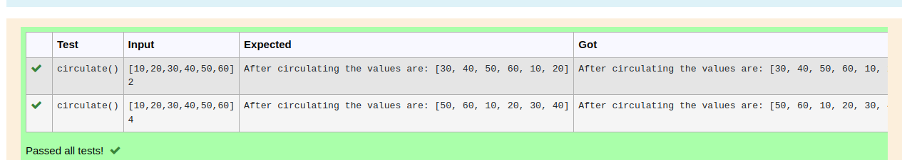

# Circulate-the-values-of-N-variables
## Aim:
To write a python program to circulate the n variables using function concept
## Equipment’s required:
PC
Anaconda - Python 3.7
## Algorithm: 
### Step 1: 
Write a python program to circulate n variables
### Step 2: 
Get the input from user
### Step 3: 
Get the value from the user for the number of rotation
### Step 4: 
Using the slicing concept rotate the list
### Step 5: 
Execute the code 
### Step 6: 
Verify the output
## Program:
```python
#Program to circulate N values.
#Developed by: Vishnupriya R
#RegisterNumber: 22006962
a=eval(input())
b=int(input())
def circulate():
    for n in range (b+1):
        c=a[n:]+a[:n]
    return c
print("After circulating the values are:",circulate())
```
## Output:

## Result:
The circulation of n values are successfully executed.